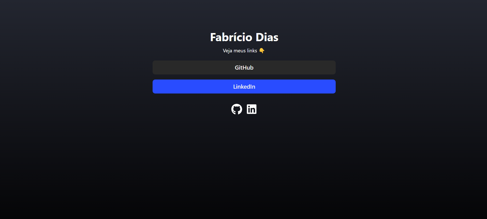
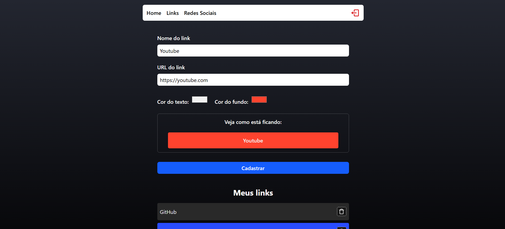
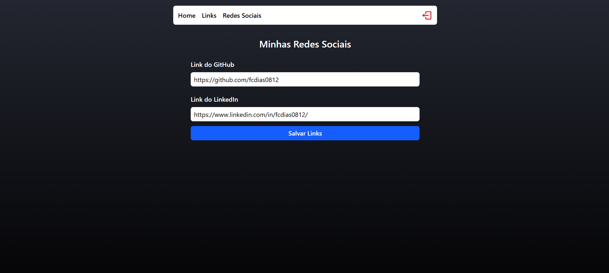

# DevLink

Projeto desenvolvido durante o curso do [Sujeito Programador](https://sujeitoprogramador.com/) ministrado por Matheus Fraga.

Uma aplicação web moderna para gerenciamento de links e redes sociais, desenvolvida com React, TypeScript e Firebase.

## 📸 Preview

<div align="center">
  
  <br/> <br/>
  
  <br/> <br/>
  
</div>

## 🚀 Tecnologias Utilizadas

- React
- TypeScript
- Firebase (Authentication, Firestore)
- React Router
- React Toastify
- Tailwind CSS

## 📋 Funcionalidades

- Autenticação de usuários
- Dashboard administrativo
- Gerenciamento de links
- Gerenciamento de redes sociais
- Interface responsiva
- Notificações toast

## 🛠️ Instalação

1. Clone o repositório:

```bash
git clone https://github.com/fcdias0812/devlinks.git
```

2. Instale as dependências:

```bash
npm install
```

3. Inicie o servidor de desenvolvimento:

```bash
npm run dev
```

## 📁 Estrutura do Projeto

```
src/
├── components/     # Componentes reutilizáveis
├── pages/         # Páginas da aplicação
│   ├── admin/     # Dashboard administrativo
│   ├── home/      # Página inicial
│   ├── login/     # Página de login
│   └── networks/  # Gerenciamento de redes sociais
├── routes/        # Configuração de rotas
├── services/      # Serviços (Firebase, etc)
└── types/         # Definições de tipos TypeScript
```

## 🔒 Autenticação

A aplicação utiliza Firebase Authentication para gerenciar o acesso dos usuários. As rotas protegidas são acessíveis apenas após o login.

## 🎨 Estilização

O projeto utiliza Tailwind CSS para estilização, proporcionando uma interface moderna e responsiva.

## 📱 Responsividade

A aplicação é totalmente responsiva, adaptando-se a diferentes tamanhos de tela.

## 🔄 Deploy

Para fazer o deploy da aplicação:

1. Construa o projeto:

```bash
npm run build
```

2. O diretório `dist` será gerado com os arquivos otimizados para produção.

## 📝 Licença

Este projeto está sob a licença MIT. Veja o arquivo [LICENSE](LICENSE) para mais detalhes.

## 👥 Contribuição

Contribuições são bem-vindas! Sinta-se à vontade para abrir issues ou enviar pull requests.

## 📧 Contato

Para mais informações, entre em contato através do email: seu-email@exemplo.com

---

Desenvolvido como parte do curso do [Sujeito Programador](https://sujeitoprogramador.com/)
